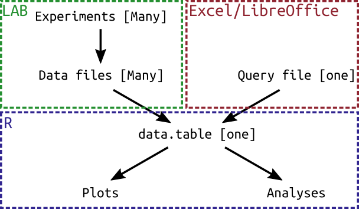

  
  
Aims
----- 
  
In this tutorial, we will learn:
  
* How to install `rethomics`
* The basic principles of the package

Installing `rethomics`
----------------------------------------

### Through CRAN:

Rethomics is not yet on CRAN. Hopefully, this will happen soon.

### Using `devtools`

`devtools` is an R package that facilitates, amonst other things, installation unofficial packages.
First, we can install devtools and load it:

```{r, eval=FALSE}
install.packages("devtools")
library("devtools")
```

Then, we use the `install_github()` function to fetch the latest stable version of `rethomics` directly from our repository:

```{r, eval=FALSE}
install_github("gilestrolab/rethomics", subdir="rethomics")
```

Finally, we should be able to load rethomics:

```{r, eval=FALSE}
library("rethomics")
```

Basic concepts
-------------------

This figure represent the typical behavioural analysis workflow. Regardless of what you want to do with `rethomics`, you will mostl likely go through these steps:





There are three important notions to highlight at this stage:

* Several types of behavioural data -- from different platforms -- can be loaded (e.g., DAM vs Ethoscope).
* Data are loaded though the **query** mechanism, wich is conveninent in an experimental context.
* Once loaded, data from different platform share the **same internal structure** (`data.table`), so similar plots and analysis can be used regardless of the input type.


In other pages of this tutorial, we will learn [how to write format queries](queries.html), how [behavioural data is stored](data_structure.html) and how to load specific types of behavioural data.
