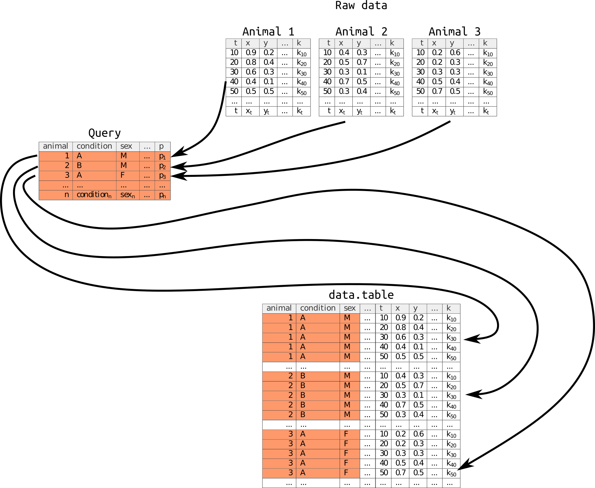

Aims
----- 

In this tutorial, we will learn:

* The concept of query
* How some `rethomics` can use queries to load data

Queries are just like lab-book entries
----------------------------------------
This part is a little bit abstract, but things will make more sense after reading the next few tutorials -- about specific kinds of data.

When performing ethological experiments, you will most likely have **multiple animals to which you apply different conditions/treatments/...**.
For each of these animals, you will record variables over time (time series).
In most cases, you will want to associcate the conditions in the query to the recorded variable, so that you retain biological information when you perform analysis.

The schematic below shows how query are used, in conjunctions with the raw data, to make the final `data.table` -- which is the starting point for further analysis.



There are three important type of tables here:

* The **raw data** are aquiered by a platform (e.g. ethoscope and DAM). We have data from *n* animals (only 3 shown for clarity). Each set of raw data is a series of *t* reads of *k* variables. 
For instance, amongst these variables we have *x* and *y* positions, but we could have many others.

* The **query** is generated by the experimenter. It list the *n* experimental animals of interest(one per row). It also defines a set of *p* conditions/state/treatement/... variables for each animal. In this example, we defined *sex* and *condition*, but *it is important to understand that you can define other arbitrary variables* (and that you don't need *sex* and *condition*).

* The **data.table** is the result of *joining* the raw data and the query. The orange rows are from the query and have exactly the same values within one animal. In fact, unique sets of these (orange) values refer unambiguously to one and only one animal. Together, the orange columns are therefore called *key*. Even though, in this case, animals could be identified only from the column *animal*, it is useful to add the biological variable in the -- then redundant -- key.

`rethomics` uses queries to locate and load data, so in most case queries will have *compulsory columns* such as `date`, `region_id` or `path` (to the result file), but this depend on the type of data we load, and we will explain, in detail, how to read specific type of data in other tutorials.


An imaginary example of query
---------------------------------

```{r, include=FALSE}
library(rethomics)
source("rprint.R")
set.seed(1)
```

As an example of simplistic query could, we could imagine an experiment with four animals (in different ROIs) that are characterised by their sex and genotype:


```{r}
# our query is named q

q <- data.table(
   path="my_result_file.db",
   region_id = 1:4,
   sex=c("M","M","F","F"),
   genotype=c("A","B","A","B")
)
setkeyv(q,colnames(q))
print(q)
```

Here, you can see each row defines, unambiguously, an animal. Note that sometimes, you may have redundant variables.
In our example, the column `path` does not change because all data comes from the same result file.

According the specific acquisition platform, you would use a different way to load the data, but the end goal is
always to use the query to *map conditions* to time series.

For instance, imagine a hypothetical acquisition platfrom that would have recorded a variable `x` over time (`t`). Also, let's say that it recorded ten point per animal. When we apply this query, we expect ten point per animal, but we also kept the conditions that are in the query (each will be repeted ten times).
So n the end, we could have something like this:

```{r, echo=FALSE}
o <- q[,
    .(t=1:10,
      x=round(runif(10),2)),
    by=eval(colnames(q))]
print(o)
```


This example describes the general context of query, but we will see in more details how to apply it to real data very soon!


